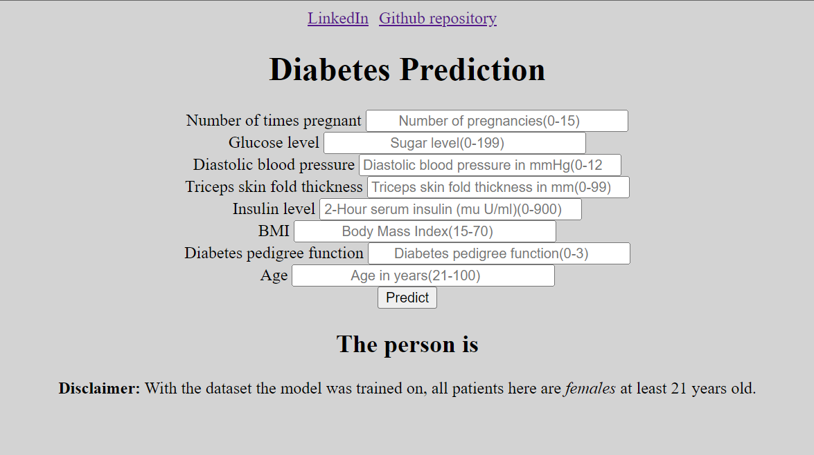

# Classification with Hyperparameter tuning
- Diabetes classification using the Prima Indians Diabetes Database
- Dataset: https://www.kaggle.com/datasets/uciml/pima-indians-diabetes-database
- Tried various classification algorithms.
- Imporved the accuracy of the models by:
  - Removing outliers from the data
  - Adjusting the hyperparametes of the models
 - Currently, the best model is logistic regression with accuracy: 82.21%, Precision: 77.50%, Recall: 60.78%, and F1-Score: 0.68.

 # About dataset:
 ### Context
This dataset is originally from the National Institute of Diabetes and Digestive and Kidney Diseases. The objective of the dataset is to diagnostically predict whether or not a patient has diabetes, based on certain diagnostic measurements included in the dataset. Several constraints were placed on the selection of these instances from a larger database. In particular, all patients here are females at least 21 years old of Pima Indian heritage.

### Content
The datasets consists of several medical predictor variables and one target variable, Outcome. Predictor variables includes the number of pregnancies the patient has had, their BMI, insulin level, age, and so on.

## Tech stack used
1. Python
2. Flask
3. HTML
4. AWS

## Deployment link
http://diabetes-env.eba-mngrqrji.eu-north-1.elasticbeanstalk.com/predictdata
## Screenshot of the webapp

# To run offline:
This can also be run offline. To do so, follow the steps below:

#### Clone the repo

`git clone 'https://github.com/LoyumM/Diabetes-classification-with-cloud-deployment.git'`

#### Create a virtual environment

`conda create -p venv python == 3.8 -y`

#### Activate environment

`conda activate venv/`

#### Install the required modules

`pip install -r requirements.txt`

#### Run the application

`python application.py`

Open the following link in a browser: http://127.0.0.1:5000/predictdata